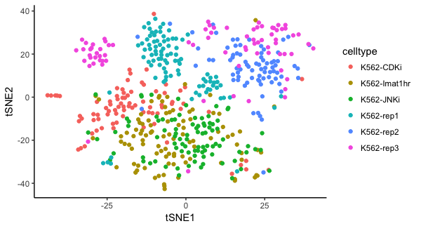
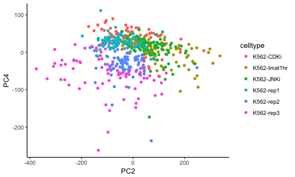
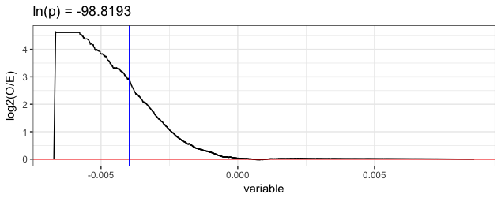

# Example Brockman analysis in R


```R
#Load sample information
sampleDesc = read.table(sprintf("/Volumes/mDCSC_ATAC/Carl/Buenrostro_2015/sample_map.txt"),sep="\t",header=T,stringsAsFactors=FALSE,quote="",row.names=NULL); 
sampleDesc$goodID = paste(sampleDesc$species, sampleDesc$celltype, sampleDesc$number,sep="_");
numLoci = read.table(sprintf("/Volumes/mDCSC_ATAC/Carl/Buenrostro_2015/uniqueLociPerCell.txt"),sep="\t",header=T,stringsAsFactors=FALSE,quote="",row.names=NULL); 
sampleDesc = merge(sampleDesc,numLoci,by=c("id”)) #here, loci is the number of transposition events per cell
```

```
> head(sampleDesc)
                  id celltype number species      goodID  loci
1  singles-BJ-well-1       BJ      1   human  human_BJ_1 47592
2 singles-BJ-well-10       BJ     10   human human_BJ_10 68719
3 singles-BJ-well-11       BJ     11   human human_BJ_11 46055
4 singles-BJ-well-12       BJ     12   human human_BJ_12   966
5 singles-BJ-well-13       BJ     13   human human_BJ_13 31265
6 singles-BJ-well-14       BJ     14   human human_BJ_14  3718
```

```R
# subset the data to the samples we are interested in (K562s) and those that pass QC (loci > 10^3.5)
sampleDesc = sampleDesc[grepl("K562", sampleDesc$celltype) & sampleDesc$loci > 10^3.5,];

# input all motif frequency files
allK562Data = inputKMerFreqs(fileNames = sprintf("/Volumes/mDCSC_ATAC/Carl//Buenrostro_2015/Buenrostro_motif_occurrence/ALL.redux/%s.freq.gz",sampleDesc$id), IDs = sampleDesc$goodID)

# do PCA and tSNE on k-mer matrix
pcs = doKMerPCA(allK562Data, nPCs = "jackstraw");
# here, `pcs` is the object returned by `prcomp`, with several other entries for tSNE and the number of significant PCs

# combine our sample description table with the tSNE projection
pcs$tSNEProj = merge(pcs$tSNEProj,sampleDesc, by.x="ID",by.y="goodID")
pcs$tSNEProj$treated = !grepl("-rep",pcs$tSNEProj$celltype)
```
```R
#make a tSNE plot of the data
p=ggplot(pcs$tSNEProj, aes(x=tSNE1, y=tSNE2, colour=celltype)) + theme_classic() + geom_point(); print(p)
```


```R

treatmentPCs = findDistinguishingPCs(pcs$x[,1:pcs$nPCs], pcs$tSNEProj[c("ID","treated")])
treatmentPCs = treatmentPCs[order(treatmentPCs$P),] # sort PCs
```

We see that PC2 and PC4 are the PCs that most distinguish the treated vs untreated cells
```
> head(treatmentPCs)
     PC     AUROC            P class
2   PC2 0.8493347 1.349506e-42  TRUE
4   PC4 0.7209281 5.103277e-18  TRUE
42 PC42 0.2939466 7.113240e-16  TRUE
31 PC31 0.7048963 1.029843e-15  TRUE
5   PC5 0.2973265 2.084614e-15  TRUE
55 PC55 0.3034469 1.398045e-14  TRUE
```
```R
#Make PC data.frame for significant PCs, add sample parameters
cellPCProjections = as.data.frame(pcs$x[,1:pcs$nPCs])
cellPCProjections$goodID = row.names(cellPCProjections);
cellPCProjections = merge(cellPCProjections, sampleDesc, by="goodID")

#plot the cells on the top two treatment PCs
p = ggplot(cellPCProjections, aes(x=PC2, y=PC4, colour=celltype)) + geom_point() + theme_classic(); print(p)

```


```R
# get enriched TFs for each PC ## if run on all PCs, this can take awhile
#tfEnrichmentsPBM = getKMerTFEnrichment(pcs$rotation[,1:pcs$nPCs], cisbp$binaryPBMZScores); #all PCs
tfEnrichmentsPBM = getKMerTFEnrichment(pcs$rotation[,c(2,4)], cisbp$binaryPBMZScores); # just PCs 2 and 4

# here would be a good place to also consider PWM motifs, and that would look something like the below:
#tfEnrichmentsPWM = getKMerTFEnrichment(pcs$rotation[,c(2,4)], cisbp$binaryPWMScores, n_max = 15000); # just PCs 2 and 4 
# this takes substantially longer because it includes all gapped k-mers, rather than just ungapped kmers (as with cisbp$binaryPBMZScores)
# Because the set size is so much larger, p-values are substantially more significant.  This leads to a lot of false positives because many motifs are so similar to each other.
# We penalized these by adding ln(10^110) to the ln(P) value, effectively making the P-value cutoff of 10^-2 be 10^-112.
# This was based on the high false-positive rate of PWM motifs (which can be highly similar and included a larger number of k-mers),
#  and the elbow of the log(P-value) curves for both PWMs and PBM 8-mer enrichments.

# add TF names to this table
tfEnrichmentsPBM = merge(tfEnrichmentsPBM, cisbp$TFTable[c("Motif_ID","TF_Name")], by="Motif_ID")

# if a TF has both directly-determined motifs and indirectly-determined motifs, consider only those that are directly determined
tfEnrichmentsPBM = preferDirect(tfEnrichmentsPBM, cisbp$TFTable)

#This would also be a good time to filter out TFs that are expressed in your system, but here we will leave all TFs

# Correct for multiple hypothesis testing
tfEnrichmentsPBM$Bon.P = tfEnrichmentsPBM$p + log(nrow(tfEnrichmentsPBM)) +  log(3000) #approximate Bonferroni MHT correction; multiply by 3000 for n_max

# Take significant hits
tfEnrichmentsPBM = tfEnrichmentsPBM[tfEnrichmentsPBM$Bon.P < log(0.01),] # cutoff of P<0.01

# sort by significance
tfEnrichmentsPBM = tfEnrichmentsPBM[order(tfEnrichmentsPBM$p),]

# remove motifs that appear to be redundant, keeping the best motif per PC/enrichment direction, regardless of the corresponding TF
tfEnrichmentsPBM_NR = dropSimilarMotifs(tfEnrichmentsPBM, cisbp$similarMotifs); #similarity defaults to 0.5, which may need to be increased for some applications if too dissimilar motifs are being consolidated

# take best motif per TF, if TFs have more than one motif per PC/enrichment direction
tfEnrichmentsPBM_NR_onePerTF = bestMotifPerTF(tfEnrichmentsPBM_NR);

#sort by significance
tfEnrichmentsPBM_NR_onePerTF = tfEnrichmentsPBM_NR_onePerTF[order(tfEnrichmentsPBM_NR_onePerTF$p),]
head(tfEnrichmentsPBM_NR_onePerTF[tfEnrichmentsPBM_NR_onePerTF$PC!="PC1",1:8]) # PC1 is often highly-correlated with GC content
```

```
> nrow(tfEnrichmentsPBM)
[1] 1723
> head(tfEnrichmentsPBM[tfEnrichmentsPBM$PC!="PC1",]) # PC1 is often highly-correlated with GC content
            Motif_ID TF_Name  PC         p    k   log2OR direction    i indirect     Bon.P
811   M0290_1.02.PBM    MAFF PC2 -191.2489 2981 1.469491      high   78          -173.7664
816   M0290_1.02.PBM    MAFG PC2 -191.2489 2981 1.469491      high   78          -173.7664
817   M0290_1.02.PBM    MAFK PC2 -191.2489 2981 1.469491      high   78          -173.7664
12014 M1298_1.02.PBM     SRF PC2 -186.9523 2991 1.929593      high  150          -169.4698
1853  M0594_1.02.PBM   LIN54 PC2 -173.3459 2998 1.344075      high 1122          -155.8635
1850  M0593_1.02.PBM   LIN54 PC2 -164.2049 2998 1.242596      high 1102          -146.7225
> nrow(tfEnrichmentsPBM_NR_onePerTF)
[1] 186
> head(tfEnrichmentsPBM_NR_onePerTF[tfEnrichmentsPBM_NR_onePerTF$PC!="PC1",1:8]) # PC1 is often highly-correlated with GC content
           Motif_ID TF_Name  PC          p    k   log2OR direction  i
811  M0290_1.02.PBM    MAFF PC2 -191.24890 2981 1.469491      high 78
816  M0290_1.02.PBM    MAFG PC2 -191.24890 2981 1.469491      high 78
817  M0290_1.02.PBM    MAFK PC2 -191.24890 2981 1.469491      high 78
6552 M0784_1.02.PBM   GATA1 PC2  -98.81934  243 2.900096       low 51
6556 M0784_1.02.PBM   GATA2 PC2  -98.81934  243 2.900096       low 51
6560 M0784_1.02.PBM   GATA3 PC2  -98.81934  243 2.900096       low 51
```

```
> # this is how you would do isolated minimum hypergeometric tests 
> # NOTE: decreasing = T sorts in the opposite direction, so considers enrichment among highly-weighted k-mers
> minHG(as.logical(cisbp$binaryPBMZScores[order(pcs$rotation[row.names(cisbp$binaryPBMZScores),treatmentPCs$PC[1]]),"M0312_1.02.PBM"])); # low
$lnMinP
[1] -13.28434

$k
[1] 107

$log2OR
[1] 3.033203

$n_max
[1] 32895

> minHG(as.logical(cisbp$binaryPBMZScores[order(pcs$rotation[row.names(cisbp$binaryPBMZScores),treatmentPCs$PC[1]],decreasing = T),"M0312_1.02.PBM"])); # high
$lnMinP
[1] -29.18954

$k
[1] 9249

$log2OR
[1] 0.7334442

$n_max
[1] 32895
```


```
> # get the most significant motif for the top treatment PC
> topTreatmentMotif = head(tfEnrichmentsPBM$Motif_ID[tfEnrichmentsPBM$PC==treatmentPCs$PC[1] & tfEnrichmentsPBM$direction=="low"],n=1);
> topTreatmentMotif
[1] "M0784_1.02.PBM"
> # Open a URL in a browser to see more information about this motif
> browseURL(sprintf("http://cisbp.ccbr.utoronto.ca/matchlist.php?searchField=%s",gsub(".PBM","",topTreatmentMotif))) #open up the TF splash page for the motif's corresponding TF
```
This last command opened a link [here](http://cisbp.ccbr.utoronto.ca/TFreport.php?searchTF=T084793_1.02), showing that this motif was derived from the mouse Gata5 TF, and looks to be a canonical GATA motif.
```R
# make an enrichment plot for this PC and the top treatment-associated motif.
p = makeEnrichmentGraphForPC(pcs$rotation[,treatmentPCs$PC[1]],cisbp$binaryPBMZScores[,topTreatmentMotif])
```


This plot shows the observed/expected (y-axis) number of k-mers matching the cognate motifs for this Gata5 motif, for all k-mer weights for the given PC (PC2; x-axis).
